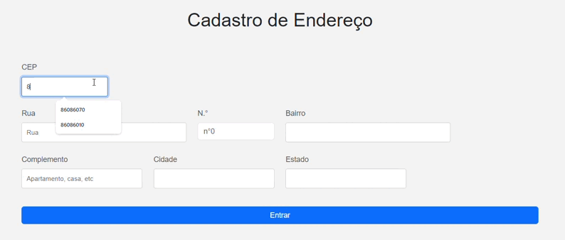

# form-cadendereco
# Cadastro de Endereço

Este projeto consiste em um formulário simples para o cadastro de endereços. A interface permite que os usuários insiram informações essenciais, como CEP, rua, número, bairro, complemento, cidade e estado.

## Estrutura do Projeto

O projeto é composto por três arquivos principais:

1. **index.html**: O arquivo HTML que contém a estrutura do formulário.
2. **endereco.css**: O arquivo CSS para estilização do formulário.
3. **main.js**: O arquivo JavaScript (atualmente vazio, mas destinado a futuras funcionalidades).

## Funcionalidades

- **Inputs**: O formulário inclui campos para capturar informações do endereço:
  - CEP
  - Rua
  - Número
  - Bairro
  - Complemento
  - Cidade
  - Estado
- **Botão de Enviar**: Um botão para submeter o formulário.

## Como Usar

1. **Clone o Repositório**:
   ```bash
   git clone <URL_DO_REPOSITÓRIO>
   cd nome-do-repositorio
   ```

2. **Abra o arquivo `index.html` em um navegador** para visualizar e interagir com o formulário.

3. **Preencha os campos** com as informações do endereço desejado.

4. **Clique no botão "Entrar"** para enviar os dados (a funcionalidade de envio deve ser implementada no arquivo `main.js`).

## Requisitos

- Um navegador moderno para visualizar a página.
- (Opcional) Um servidor local se você deseja testar a funcionalidade de envio de dados.

## Contribuições

Contribuições são bem-vindas! Sinta-se à vontade para abrir um problema (issue) ou fazer um pull request.

## Licença

Este projeto é de código aberto e pode ser utilizado e modificado conforme necessário.
 


### codigo js

### README - Funções de Validação e Busca de Endereço

Este documento explica as funções JavaScript para validar e buscar informações de um endereço usando o CEP.

## Funções JavaScript

### 1. `buscarEndereco()`

Esta função busca o endereço baseado no CEP informado pelo usuário.

```javascript
async function buscarEndereco() {
    const cep = document.getElementById('cep').value.replace(/\D/g, '');
    const resultado = document.getElementById('resultado');
    if (cep.length !== 8) {
        resultado.innerHTML = 'CEP inválido.';
        return;
    }

    try {
        const response = await fetch(`https://viacep.com.br/ws/${cep}/json/`);
        const data = await response.json();

        if (data.erro) {
            resultado.innerHTML = 'CEP não encontrado.';
        } else {
            document.getElementById('rua').value = data.logradouro;
            document.getElementById('bairro').value = data.bairro;
            document.getElementById('cidade').value = data.localidade;
            document.getElementById('estado').value = data.uf;
            resultado.innerHTML = '';
        }
    } catch (error) {
        resultado.innerHTML = 'Erro ao buscar o endereço.';
    }
}
```

#### Como Funciona:
- **Entrada**: O CEP é extraído do campo de entrada e formatado.
- **Validação**: Verifica se o CEP possui 8 dígitos. Se não, exibe uma mensagem de erro.
- **Busca**: Realiza uma chamada à API `viaCEP` para obter informações do endereço.
- **Preenchimento**: Preenche os campos de endereço se o CEP for válido.
- **Tratamento de Erros**: Exibe uma mensagem em caso de falha na busca.

### 2. `validarEmail(email)`

Valida se o email está em um formato correto.

```javascript
function validarEmail(email) {
    const re = /^[^\s@]+@[^\s@]+\.[^\s@]+$/;
    return re.test(String(email).toLowerCase());
}
```

#### Como Funciona:
- Usa uma expressão regular para verificar se o email tem um formato válido.
- Retorna `true` se o email for válido, `false` caso contrário.

### 3. `validarCPF(cpf)`

Valida o CPF com base em regras simples.

```javascript
function validarCPF(cpf) {
    cpf = cpf.replace(/\D/g, '');
    if (cpf.length !== 11) return false;

    // Validação simplificada do CPF
    let soma = 0;
    let resto;
    for (let i = 1; i <= 9; i++) {
        soma += parseInt(cpf.substring(i - 1, i)) * (11 - i);
    }
    resto = (soma * 10) % 11;
    if (resto === 10 || resto === 11) resto = 0;
    if (resto !== parseInt(cpf.charAt(9))) return false;

    soma = 0;
    for (let i = 1; i <= 10; i++) {
        soma += parseInt(cpf.substring(i - 1, i)) * (12 - i);
    }
    resto = (soma * 10) % 11;
    if (resto === 10 || resto === 11) resto = 0;
    return resto === parseInt(cpf.charAt(10));
}
```

#### Como Funciona:
- Remove caracteres não numéricos e verifica se o CPF possui 11 dígitos.
- Realiza cálculos para validar os dígitos verificadores do CPF.
- Retorna `true` se o CPF for válido e `false` caso contrário.

### 4. `validarFormulario(event)`

Valida o formulário antes de ser enviado.

```javascript
function validarFormulario(event) {
    const email = document.getElementById('email').value;
    const cpf = document.getElementById('cpf').value;

    if (!validarEmail(email)) {
        alert('Email inválido!');
        event.preventDefault();
    }

    if (!validarCPF(cpf)) {
        alert('CPF inválido!');
        event.preventDefault();
    }
}
```


- Obtém os valores do email e CPF do formulário.
- Chama as funções `validarEmail` e `validarCPF`.
- Se alguma validação falhar, exibe um alerta e impede o envio do formulário.

## Conclusão

Essas funções garantem que os dados do formulário sejam válidos e que as informações de endereço sejam recuperadas corretamente. Para um melhor desempenho, certifique-se de que o HTML e os arquivos CSS estejam corretamente configurados para acompanhar essas funções.

Esse código é uma implementação simples e eficaz para buscar informações de endereço a partir de um CEP, utilizando a API ViaCEP. Ele realiza a validação do CEP, manipula a interface do usuário e lida com respostas da API, tudo de forma assíncrona. Isso melhora a experiência do usuário ao preencher formulários relacionados a endereços.

## fontes ultilizadas 
* git hub
* vscode
* google


## Autores 

* Nkillas Angelo Toquio(https://github.com/Nkollastoquio)
* maria isabel(https://github.com/belsil5aa)
* Maria eduarda(https://github.com/dudafontinele)
* Professor Leonardo(https://github.com/LeonardoRochaMarista/LeonardoRochaMarista)


## Resultado
